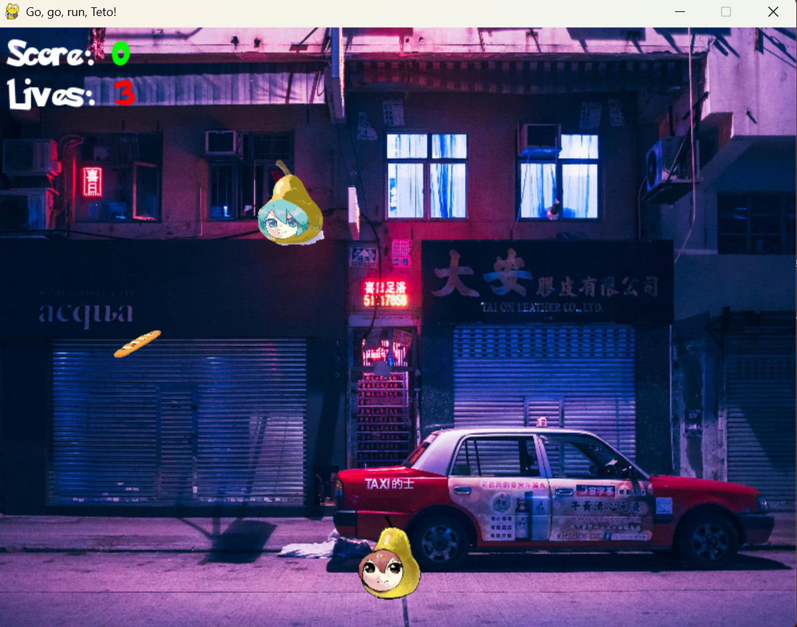

# GO, GO, RUN, TETO!

## OVERVIEW
"Go, Go, Run, Teto!" is a fast-paced arcade game where you play as Pear Teto, navigating through a challenging environment. Your goal is to avoid the pursuing Pear Miku while collecting as many bread items as possible to increase your score.

GAMEPLAY
- Character: Control Pear Teto
- Goal: Survive as long as possible while maximizing your score
- Mechanics:
  * Dodge Pear Miku who constantly chases you
  * Collect bread items that appear throughout the level
  * Score increases with each bread collected and time survived
  * Game difficulty increases over time

## CONTROLS
- Use arrow keys to move Pear Teto around the screen
- Press SPACE to start a new game from the menu
- Press Q to quit the game

## ACHIEVEMENTS
Unlock achievements by completing specific challenges in the game. Here’s a list of all achievements and how to earn them:

| **Achievement**         | **Description**                          | **Requirement**                                                                 |
|--------------------------|------------------------------------------|---------------------------------------------------------------------------------|
| **Bread Eater**          | Score your first point.                  | Score at least **10 points**.                                                  |
| **Bread Collector**      | Collect 50 objects.                     | Collect **50 bread items**.                                                    |
| **I'm Still Standing**   | Survive for 60 seconds.                 | Survive for **60 seconds** without getting caught by Pear Miku.                |
| **High Score**           | Reach a score of 500.                   | Achieve a score of **500**.                                                    |
| **Very High Score**      | Reach a score of 1000.                  | Achieve a score of **1000**.                                                   |
| **Very Very High Score** | Reach a score of 5000.                  | Achieve a score of **5000**.                                                   |

---

## TECHNICAL INFO
This game is built using Python with the Pygame library. Game progress including achievements and high scores are automatically saved to continue your progress between sessions.

## CREDITS
"Go, Go, Run, Teto!" is a fan-made arcade game featuring characters inspired by Kasane Teto and Hatsune Miku.